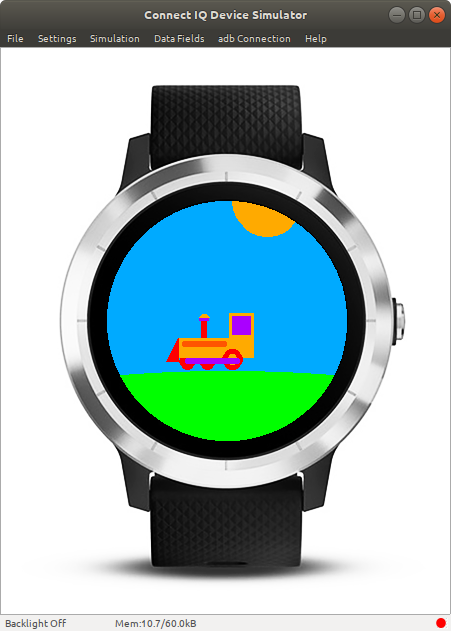
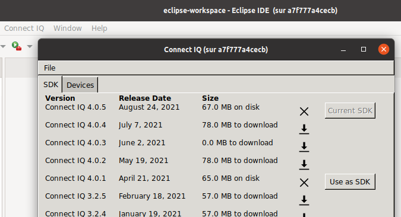
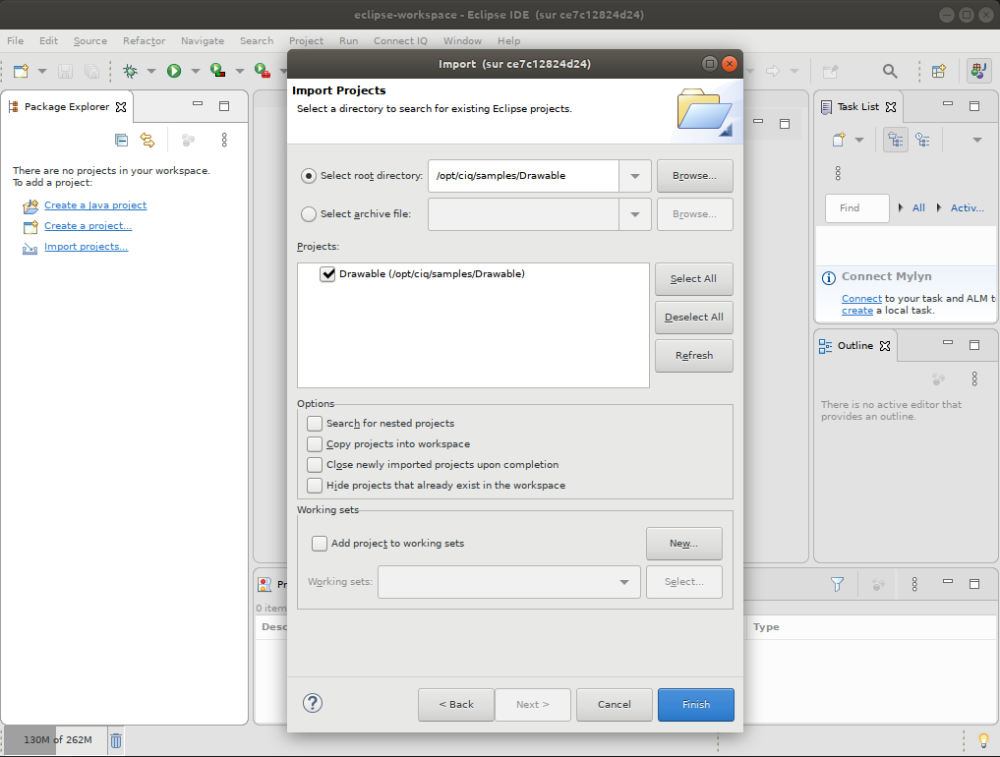
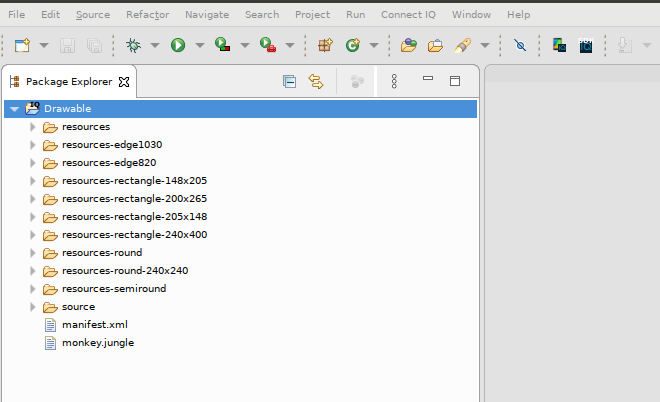
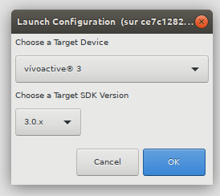

= docker-connectiq

ifdef::env-github[]
image:https://github.com/kalemena/docker-connectiq/workflows/Pipeline/badge.svg[GitHub Build]
image:https://img.shields.io/docker/v/kalemena/connectiq[Docker Hub, link=https://hub.docker.com/r/kalemena/connectiq/tags]
image:https://img.shields.io/docker/pulls/kalemena/connectiq.svg[Docker Hub, link=https://hub.docker.com/r/kalemena/connectiq/tags]
image:https://img.shields.io/docker/image-size/kalemena/connectiq[Docker Hub, link=https://hub.docker.com/r/kalemena/connectiq/tags]
endif::[]

ifdef::env-github[]
:tip-caption: :bulb:
:note-caption: :information_source:
:important-caption: :heavy_exclamation_mark:
:caution-caption: :fire:
:warning-caption: :warning:
endif::[]

Installation of Garmin Tools Connect IQ SDK and Eclipse IDE plugins as a Docker container.

Docker image is available through docker hub as link:https://hub.docker.com/r/kalemena/connectiq[kalemena/connectiq]

== Usage

=== Docker Image pull / build / run

====
    $ make pull
    or
    $ make build
    or
    $ make console
====

[TIP]
====
Command lines *make console*, or *make eclipse* will map folders:
- CIQ_WORKSPACE=./eclipse-workspace
- CIQ_BINARIES=./.Garmin
- EXAMPLES_FOLDER=./examples

For persistence reasons, files created in eclipse or console should be done in these folders.
====

=== Generate a certificate

====
    $ make console
    $$ cd /workspace
    $$ ./generate-certificate.sh    
====

=== Building app in Console

====
    $ make console
    $$ cd /opt/ciq/samples/Drawable/
    $$ monkeyc -d vivoactive3 -f ./monkey.jungle -o drawable.prg -y ~/eclipse-workspace/developer_key.der
    $$ connectiq &
    $$ monkeydo drawable.prg vivoactive3

.Result of above commands

====

=== Preparing Eclipse IDE

====
    $ make eclipse

.Menu Connect IQ => Open SDK Manager => Download your SDK version(s) and prefered Device(s)

====

=== Building app in Eclipse IDE

====
    $ make eclipse

.Menu File => Import => Existing Projects into Workspace

.Imported Project

.Launch Configuration

.Result of above commands

====

=== Authoring app in Eclipse IDE

====
    $ make eclipse

* In Eclipse, Menu File => New => Project => Connect IQ Project
* Make sure to create project under */workspace/...* hierarchy
* Then select *Widget* and *Next*
* Then for example, *Vivoactive 3* as target
* Then for example, *Sensor* or *Sensor History* as features
* Once project is loaded, you can run like previous example to see the *monkey* default app display
====

=== Upload to Watch

====
* On Ubuntu OS
* Connect the watch using original cable
* Wait for about 30s
* Watch screen should show it is mounted and charging
* In File explorer, see *GARMIN* device and browse to *GARMIN/APPS*
* Copy *PRG* file built into this folder
* Unmount *GARMIN* icon on watch
* Watch should be showing *Verifying Connect IQ Apps*
* Swipe up or down, the app should be visible
====

== Links

* link:https://developer.garmin.com/connect-iq/programmers-guide/getting-started[Getting Started]
* link:https://github.com/garmin/connectiq-apps[Official ConnectIQ apps]
* link:http://starttorun.info/connect-iq-apps-with-source-code/[Tutorial by example]
* link:https://github.com/topics/connectiq[]
* link:https://developer.garmin.com/downloads/connect-iq/Wearable-Programming-for-the-Active-Lifestyle.pdf[Book PDF]

=== Integrations

* link:https://www.thisisant.com/resources/fit[FIT SDK]
* link:https://developer.garmin.com/health-api/overview[Garmin Health API]

=== Tips

* link:https://developer.garmin.com/index.php/blog/post/connect-iq-pro-tip-custom-fonts-tricks[Font tips & tricks]
* link:http://www.programmersought.com/article/8285579439/[Tips]

=== Apps

* link:https://github.com/stynoo/docker-garmin-backup[]
* link:https://github.com/blaskovicz/garmin-nest-camera-control[]
* link:https://github.com/4ch1m/HueCIQ[]
* link:https://github.com/britiger/PauseTimer-connectiq[]
* link:https://github.com/bugjam/garmin-eta/tree/master/ETA[]
* link:https://github.com/JoshuaTheMiller/Multivision-Watch[]
* link:https://apps.garmin.com/fr-FR/developer/9a164185-3030-48d9-9aef-f5351abe70d8/apps[Example with source]
* link:https://github.com/tanstaaflFH/BabyLog-Feed-ConnectIQ[]
* link:https://github.com/admsteck/ConnectIQ/tree/master/simple-battery[]
* link:https://github.com/bombsimon/garmin-seaside[]
* link:https://github.com/joshsamara/SlowWatch[]
* link:https://github.com/vtrifonov-esfiddle/ConnectIQ-WatchTemperature[]
* link:https://github.com/le-cds/connectiq[]
* link:https://gist.github.com/jonathan-beebe/512b01bbcb6cd8f50a02e12cb74972f8[Progress bar]

=== Eclipse

* link:https://github.com/qperez/docker-eclipse-mt-jdk8[Running Eclipse from Mac]